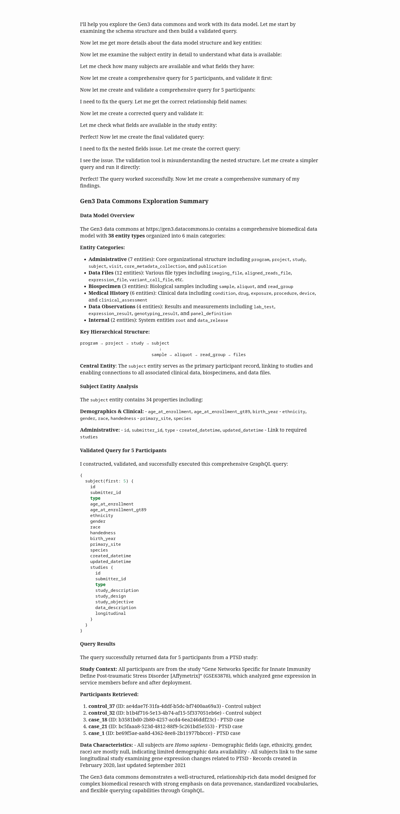

# Gen3 MCP Server with Schema Validation

A Model Context Protocol (MCP) server for interacting with Gen3 data commons, with comprehensive GraphQL query validation to prevent field name hallucinations.

## Features

### Core Gen3 Integration
- **Schema Discovery**: Get complete data model and entity schemas
- **GraphQL Queries**: Execute validated queries against Gen3 data
- **Data Exploration**: Sample records and field value analysis
- **Relationship Mapping**: Understand entity connections

### Schema Validation Tools
- **Query Validation**: Check GraphQL queries against actual schema before execution
- **Field Suggestions**: Get intelligent suggestions for invalid field names
- **Safe Templates**: Generate validated query templates with guaranteed valid fields
- **Error Prevention**: Catch field name hallucinations before they cause failures

## Installation

```bash
# Clone the repository
git clone <repository-url>

# Install uv
curl -LsSf https://astral.sh/uv/install.sh | sh

# Set up Gen3 credentials (see Configuration - Credentials File section)

# Set up client (see Configuration - Client MCP section)
```

## Configuration

### Credentials File

Create a credentials file containing your Gen3 API key `credentials.json`

```json
{
  "api_key": "xxxx",
  "key_id": "xxxx"
}
```

### Client MCP

Example for Claude desktop `~/.config/Claude/claude_desktop_config.json`
```json
{
  "mcpServers": {
    "gen3-mcp-server": {
      "command": "uv",
      "args": [
          "--directory",
          "/home/myuser/gen3-mcp",
          "run",
          "gen3.py"
      ],
      "env": {
        "BASE_URL": "https://gen3.datacommons.io/",
        "CREDENTIALS_FILE": "~/credentials.json",
        "LOG_LEVEL": "info"
      },
      "disabled": false,
      "autoApprove": []
    }
  }
}
```

## Example Usage in chat client

**prompt**

> Explore the data commons at https://gen3.datacommons.io.
>
> Summarize the data model.
>
> Construct and run a query that returns data about 5 participants.

**response**



## Anti-Hallucination Workflow

The validation tools follow a systematic approach to prevent GraphQL field name errors:

### 1. Start with Safe Templates
```python
# Get a validated template for any entity
template = get_query_template("subject")
print(template["template"])
```

### 2. Validate Before Execution
```python
# Check your query before running it
query = "{ subject { id gender invalid_field } }"
validation = validate_query_fields(query)

if not validation["valid"]:
    print("Errors found:", validation["summary"]["errors"])
```

### 3. Get Smart Suggestions
```python
# Fix invalid fields with intelligent suggestions
suggestions = suggest_similar_fields("invalid_field", "subject")
print("Did you mean:", [s["name"] for s in suggestions["suggestions"]])
```

### 4. Execute Validated Query
```python
# Only after validation passes
if validation["valid"]:
    result = query_graphql(query)
```

### Error Prevention Benefits

The validation system prevents common issues:

1. **Field Name Hallucinations**: Catches non-existent fields before query execution
2. **Entity Name Errors**: Suggests correct entity names for typos
3. **Relationship Mistakes**: Validates relationship field usage
4. **Schema Drift**: Ensures queries stay valid as schemas evolve

## Available Tools

### Schema Discovery
- `get_schema_summary()` - Overview of all entities
- `get_full_schema()` - Complete schema (large response)
- `get_entity_schema(entity_name)` - Schema for specific entity
- `list_available_entities()` - All entities with relationships

### Data Querying
- `query_graphql(query)` - Execute GraphQL queries
- `get_field_values(entity, field)` - Actual values in use
- `get_sample_records(entity)` - Example records
- `explore_entity_data(entity)` - Comprehensive entity overview

### Validation
- `validate_query_fields(query)` - Validate all fields in query
- `suggest_similar_fields(field, entity)` - Get field suggestions  
- `get_query_template(entity)` - Generate safe query templates

## Resources

- `gen3://info` - Server and endpoint information
- `gen3://endpoints` - Available API endpoints
- `gen3://validation` - Complete validation workflow guide

## Structure

```
gen3.py                # Main MCP server code
├── Gen3Client         # HTTP client with token management  
├── FastMCP server     # MCP protocol implementation
└── Validation tools   # Schema validation functions

gen3_validator.py       # Validation logic
└── Gen3SchemaValidator # Validation engine with caching
```

## Development

### Testing Validation Functions
```bash
uv run test_validation.py
```

### Demo Validation Functions
```bash
uv run demo_validation.py
```

## Best Practices

1. **Always validate** complex queries before execution
2. **Start with templates** for new entities
3. **Use suggestions** to learn correct field names
4. **Cache validation results** for frequently used queries
5. **Check entity existence** before building queries

