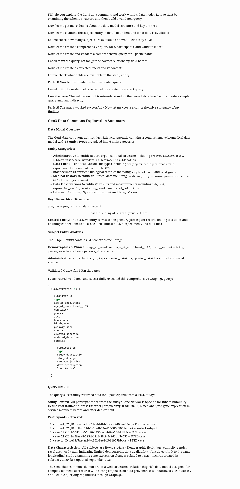

# Gen3 MCP Server

A Model Context Protocol (MCP) server for interacting with Gen3 data commons, with comprehensive GraphQL query validation to prevent field name hallucinations.

## Features

### Core Gen3 Integration
- **Schema Discovery**: Get complete data model and entity schemas
- **GraphQL Queries**: Execute validated queries against Gen3 data
- **Data Exploration**: Sample records and field value analysis
- **Relationship Mapping**: Understand entity connections

### Schema Validation Tools
- **Query Validation**: Check GraphQL queries against actual schema before execution
- **Field Suggestions**: Get intelligent suggestions for invalid field names
- **Safe Templates**: Generate validated query templates with guaranteed valid fields
- **Error Prevention**: Catch field name hallucinations before they cause failures

## Install and Configure 

These instructions are for using the server in a chat client. For development, see [below](#Development).

```bash
# Clone the repository
git clone <repository-url>

# Install uv
curl -LsSf https://astral.sh/uv/install.sh | sh
```

### Create Gen3 credentials file

Create a file `credentials.json` containing your Gen3 API key:

```json
{
  "api_key": "xxxx",
  "key_id": "xxxx"
}
```

### Configure chat client

Example for Claude Desktop `~/.config/Claude/claude_desktop_config.json`:

```json
{
  "mcpServers": {
    "gen3-mcp-server": {
      "command": "uvx",
      "args": [
        "--from", "/path/to/gen3-mcp",
        "gen3-mcp"
      ],
      "env": {
        "GEN3_CREDENTIALS_FILE": "/path/to/credentials.json",
        "GEN3_BASE_URL": "https://gen3.datacommons.io/",
        "GEN3_LOG_LEVEL": "INFO"
      }
    }
  }
}
```

## Example Usage in chat client

**prompt**

> Explore the data commons at https://gen3.datacommons.io.
>
> Summarize the data model.
>
> Construct and run a query that returns data about 5 participants.

**response**



## Development

```bash
# Clone the repository
git clone <repository-url>
cd gen3-mcp

# create uv venv and install dependencies
./setup_dev.sh

# activate the virtual environment
source .venv/bin/activate

# run tests
pytest -v -W default

# format code
black src/ tests/
```

## Usage in code

### Configuration
Configuration in `settings.py` is set via environment variables:
```bash
export GEN3_LOG_LEVEL=DEBUG
export GEN3_BASE_URL=https://commons.example.com
export GEN3_CREDENTIALS_FILE=~/.gen3/credentials.json
```

### Schema Operations
```python
# Get schema summary
schema_operations(operation="summary")

# Get complete schema
schema_operations(operation="full")

# Get specific entity schema
schema_operations(operation="entity", entity_name="subject")

# List all entities
schema_operations(operation="entities")
```

### Data Operations
```python
# Explore entity data
data_operations(operation="explore", entity_name="subject", limit=5)

# Get sample records
data_operations(operation="sample_records", entity_name="subject", limit=3)

# Get field value distribution
data_operations(operation="field_values", entity_name="subject", field_name="gender", limit=100)
```

### Validation Operations
```python
# Validate GraphQL query
validation_operations(operation="validate_query", query="{ subject { id invalid_field } }")

# Get field suggestions
validation_operations(operation="suggest_fields", field_name="gander", entity_name="subject")

# Generate safe query template
validation_operations(operation="query_template", entity_name="subject")
```

### Direct Query Execution
```python
# Execute GraphQL query
execute_graphql(query="{ subject(first: 5) { id submitter_id gender } }")
```

## Anti-Hallucination Workflow

The validation tools follow a systematic approach to prevent GraphQL field name errors:

1. **Start with Safe Templates**
```python
template = validation_operations(operation="query_template", entity_name="subject")
print(template["template"])
```

2. **Validate Before Execution**
```python
query = "{ subject { id gender invalid_field } }"
validation = validation_operations(operation="validate_query", query=query)

if not validation["valid"]:
    print("Errors found:", validation["summary"]["errors"])
```

3. **Get Smart Suggestions**
```python
suggestions = validation_operations(
    operation="suggest_fields", 
    field_name="invalid_field", 
    entity_name="subject"
)
print("Did you mean:", [s["name"] for s in suggestions["suggestions"]])
```

4. **Execute Validated Query**
```python
if validation["valid"]:
    result = execute_graphql(query)
```


### Project Structure

```
gen3-mcp/
├── src/gen3_mcp/           # Main package
│   ├── client/             # HTTP client & authentication
│   ├── schema/             # Schema operations & validation
│   ├── query/              # GraphQL operations
│   ├── tools/              # MCP tool implementations
│   ├── resources/          # MCP resources
│   ├── config/             # Configuration management
│   └── exceptions/         # Custom exceptions
├── tests/                  # Test suite
├── docs/                   # Documentation
└── pyproject.toml          # Project configuration
```

## Acknowledgments

Built with [MCP (Model Context Protocol)](https://github.com/modelcontextprotocol) and designed for [Gen3 Data Commons](https://gen3.org/).
