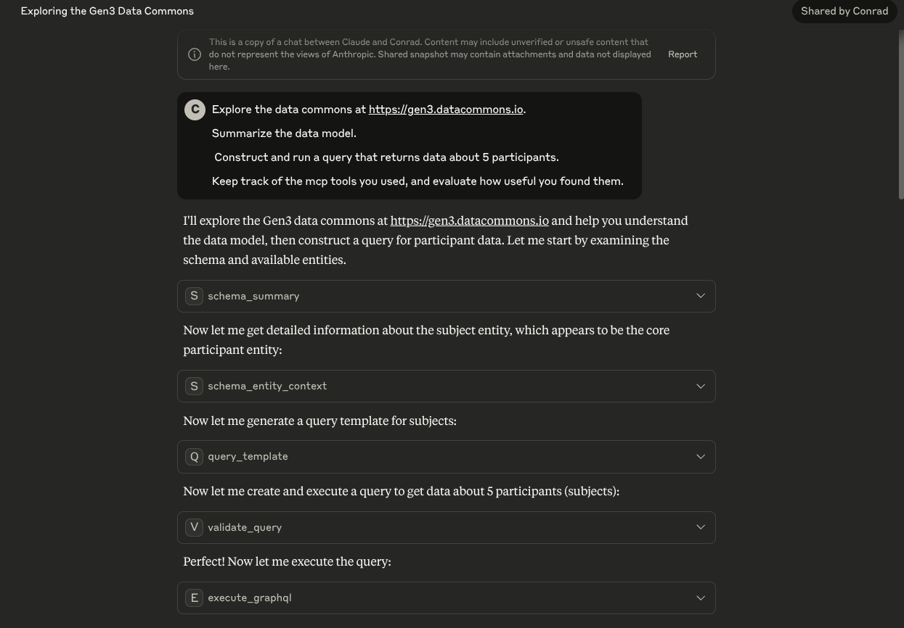

# Gen3 MCP Server

A Model Context Protocol (MCP) server for interacting with Gen3 data commons, with GraphQL query validation to reduce hallucinations.

## Install and Configure 

These instructions are for using the server in a chat client. For development, see [Development](DEVELOPMENT.md).

```bash
# Clone the repository
git clone <repository-url>

# Install uv
curl -LsSf https://astral.sh/uv/install.sh | sh
```

### Create Gen3 credentials file

Create a file `credentials.json` containing your Gen3 API key:

```json
{
  "api_key": "xxxx",
  "key_id": "xxxx"
}
```

### Configure chat client

Example for Claude Desktop `~/.config/Claude/claude_desktop_config.json`:

```json
{
  "mcpServers": {
    "gen3-mcp-server": {
      "command": "uvx",
      "args": [
        "--from", "/path/to/gen3-mcp",
        "gen3-mcp"
      ],
      "env": {
        "GEN3_CREDENTIALS_FILE": "/path/to/credentials.json",
        "GEN3_BASE_URL": "https://gen3.datacommons.io/",
        "GEN3_LOG_LEVEL": "INFO"
      }
    }
  }
}
```

## Example Usage in chat client

[](https://claude.ai/share/db7e3a4b-a200-4bff-9e9c-0e43b6708f12)


## Available Tools

The MCP server provides the following tools:

### Schema Discovery Tools
- `get_schema_summary()` - Get annotated overview of all entities and their relationships
- `get_schema_entity(entity)` - Get detailed schema info about a specific entity including all fields

### Query Building Tools  
- `generate_query_template(entity_name, include_relationships=True, max_fields=20)` - Generate safe query templates with validated fields
- `validate_query(query)` - Validate GraphQL query syntax and field names against schema

### Query Execution Tool
- `execute_graphql(query)` - Execute validated GraphQL queries against the Gen3 data commons

## Acknowledgments

Built with [MCP (Model Context Protocol)](https://github.com/modelcontextprotocol) and designed for [Gen3 Data Commons](https://gen3.org/).
